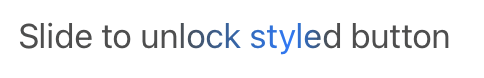

# Custom Button Styling

This is a simple project to demonstrate a custom button with a sweeping
highlight color just like the "Slide to unlock" text from the original
iPhone.

The purpose of the project is as a starter for exploring animation effects
and custom styling using SwiftUI.

## Demo video

To see the effect, please refer to the demo video

[Video of text animating a accent color](./Demo/slide-to-unlock-style.mp4)

## Credits

This code was derived from a great example of custom UI in SwiftUI,
[OldOS](https://github.com/zzanehip/The-OldOS-Project) by Zane Kleinberg
